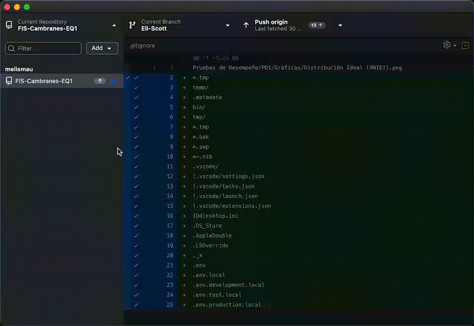

# Contributing

Antes que nada, gracias por tomar el tiempo de leer y contribuir.

Esta guía te ayudará a entender cómo contribuir de manera efectiva y mantener la consistencia del proyecto.

## Indice

- [Getting Started](#getting-started)
- [Lineamientos](#lineamientos)
    - [Commits](#commits)
    - [Pull Requests](#pull-requests)
    - [Nomenclatura](#nomenclatura)
- [Recursos Útiles](#recursos-útiles)
- [FAQ](#faq)

## Getting Started

1. **Familiarízate** con los [conceptos básicos de Git](https://www.w3schools.com/git/git_glossary.asp?remote=github) y [GitHub](https://www.w3schools.com/git/git_intro.asp?remote=github)
2. **Configura tu entorno**: Clona el repositorio y crea una rama con tu nombre 
3. **Sincronízate**: Haz pull de la rama principal más reciente antes de empezar
4. **Desarrolla**: Realiza tus cambios siguiendo nuestros [lineamientos](#lineamientos-generales)
5. **Verifica**: Comprueba tu trabajo antes de hacer commit
6. **Envía**: Crea un [pull request](#pull-requests) a la rama de entrega

## Lineamientos

- Procura utilizar formatos que [GitHub puede visualizar](https://docs.github.com/en/repositories/working-with-files/using-files/working-with-non-code-files)
    - Escribe tus documentos en [Markdown](https://www.markdownguide.org/basic-syntax/)
    - Si no es posible, guardalos como `.pdf`s
- Verifica que no tengas errores ortográficos o gramaticales
- Comprueba que tu código funcione y que tus enlaces no esten rotos

### Commits

**Importante:** Cada integrante hace **UN commit por entrega**. Este debe incluir todo tu trabajo completo y verificado.

#### Formato

***\<tipo>(\<area>): \<descripcion concisa de tu trabajo>***

**Trabajo completado:**
- Lista de entregables principales
- Organizados por categoría
- Con suficiente contexto

**Archivos principales:**
- `ruta/archivo1`
- `ruta/archivo2`
- `ruta/archivo3`

#### Tipos de Commit

Elige el tipo según la naturaleza de tu trabajo:

| Tipo | Uso | Ejemplo |
|------|-----|---------|
| `docs` | Documentación, requisitos, bitácoras | `docs(requisitos): agregar user stories validadas` |
| `design` | Diseño visual, logos, mockups | `design(interfaz): crear sistema visual completo` |
| `feat` | Código HTML/CSS/JS funcional | `feat(mockup): implementar prototipo navegable` |
| `chore` | Estructura, organización, configuración | `chore(repo): reorganizar carpetas por entrega` |

#### Áreas

| Área | Qué incluye |
|------|-------------|
| `requisitos` | User stories, requisitos funcionales/no funcionales |
| `proceso` | Bitácoras, documentación de metodología, roles |
| `interfaz` | Diseños, wireframes, guías de estilo |
| `mockup` | Código HTML/CSS/JS |
| `assets` | Imágenes, logos, iconos |
| `repo` | Estructura de carpetas, documentación del repositorio |

#### Ejemplos por Tipo de Trabajo

##### Ejemplo 1: Diseñador UI/UX

***design(interfaz): crear sistema visual y assets del mockup***

**Trabajo completado:**
- Logo de la app
- Diseño de 8 tipos de botones con estados (normal, hover, active)
- Estructura visual de 6 pantallas principales
- Paleta de colores y guia de estilo
- 15 iconos de glifos mayas en SVG

**Archivos principales:**
- `Proyecto/design/icons/logo.svg`
- `Proyecto/design/botones-sistema.png`
- `Proyecto/design/estructura-pantallas.png`
- `Proyecto/design/guia-estilo.md`
- `Proyecto/design/icons/glifos/*.svg`

##### Ejemplo 2: Técnico del repositorio

***chore(repo): actualizar estructura y documentación del repositorio***

**Trabajo completado:**
- Adición de `CONTRIBUTING.md` con lineamientos y ejemplos visuales
- Actualización de roles en los `README`s del repositorio
- Configuración del sistema de control de versiones
- Reorganización de carpetas por entrega

**Archivos principales:**
- `CONTRIBUTING.md`
- `README.md`
- `Proyecto Final/README.md`
- `.gitignore`
- `.github/*`

### Pull Requests

Después de tu commit, crea un Pull Request hacia la rama de entrega. Incluye el mismo formato del commit más este checklist:

- [ ] Revisé ortografía y gramática
- [ ] Los archivos siguen la [convención de nombres](#nomenclatura)
- [ ] Verifiqué que todo mi trabajo funcione
- [ ] No incluí archivos temporales o innecesarios

### Nomenclatura

**Carpetas Internas:**
- Minúsculas con guiones: `user-stories`, `casos-uso`

**Archivos:**
- Documentos: `nombre-descriptivo.md`
- HTML: `nombre-pagina.html`
- Imágenes: `descripcion-clara.png`

**Mal:**
- ❌ Espacios: `mi archivo.md`
- ❌ Acentos: `bitácora.md`
- ❌ Caracteres especiales: `algoritmo#1.png`
- ❌ Nombres vagos: `documento.md`, `imagen.png`

**Bien:**
- ✅ `user-stories.md`
- ✅ `bitacora-2025-10-27.md`
- ✅ `logo-color.svg`
- ✅ `pantalla-inicio.png`

## Recursos Útiles

### Git y GitHub

- [Conceptos básicos de Git](https://www.w3schools.com/git/git_glossary.asp?remote=github)
- [Introducción a GitHub](https://www.w3schools.com/git/git_intro.asp?remote=github)
- [Cómo escribir buenos commits](https://chris.beams.io/posts/git-commit/)
- [Resolver conflictos](https://docs.github.com/es/pull-requests/collaborating-with-pull-requests/addressing-merge-conflicts/resolving-a-merge-conflict-using-the-command-line)
- [Cómo deshacer tus errores en Git](https://dangitgit.com/en)

### Documentación

- [Guía de Markdown](https://www.markdownguide.org/basic-syntax/)
- [Escritura técnica efectiva](https://developers.google.com/tech-writing)

### Diseño

- [Principios de diseño UI](https://www.nngroup.com/articles/ten-usability-heuristics/)
- [Guía de colores accesibles](https://webaim.org/resources/contrastchecker/)

### Desarrollo

- [HTML semántico](https://developer.mozilla.org/es/docs/Web/HTML/Element)
- [CSS responsive](https://web.dev/responsive-web-design-basics/)
- [JavaScript básico](https://javascript.info/)

## FAQ

**¿Qué hago si tengo conflictos al hacer merge o pull?**

- Intenta [resolverlos manualmente](https://docs.github.com/en/pull-requests/collaborating-with-pull-requests/addressing-merge-conflicts/resolving-a-merge-conflict-on-github)
- Si no estás seguro, contacta al Técnico del Repositorio
- No forces el merge sin resolver los conflictos

**¿Puedo trabajar directo en la rama de entrega?**

No, siempre trabaja en tu fork/rama personal y haz PR.

**¿Qué hago si hice más commits de lo debido en mi repo local, pero todavía no se han mandado al remoto?**

Puedes consolidarlos usando `git rebase -i` para hacer un [*squash*](https://www.geeksforgeeks.org/git/git-squash/) antes de hacer push.

**...¿Y si ya los mande al remoto?**

- Contacta al Técnico del Repositorio para ayuda con rewrite de historial
- En casos extremos, podemos crear una rama nueva con tu trabajo consolidado...

---

Necesitas ayuda? Tienes dudas? Abre un [issue](https://github.com/melismau/FIS-Cambranes-EQ1/issues) o contacta al Técnico del Repositorio.