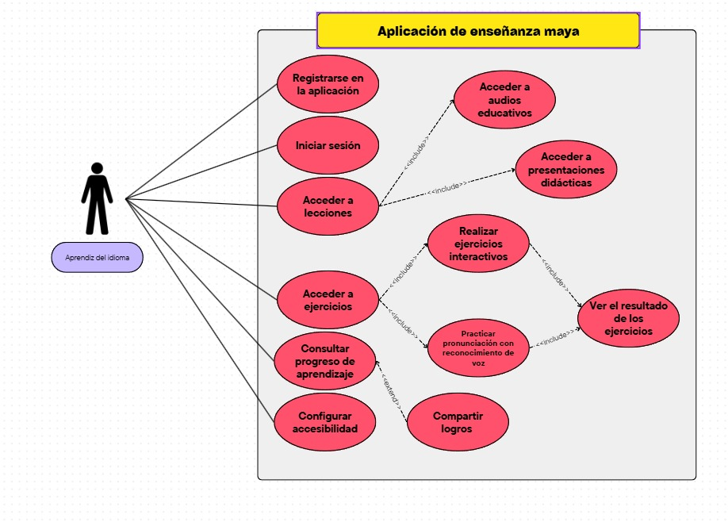

# Mayapprendo - App de Aprendizaje de la Lengua Maya

## 📌 Descripción del Proyecto
[Vea nuestro video informativo aquí (ext)](https://alumnosuady-my.sharepoint.com/personal/a22204188_alumnos_uady_mx/_layouts/15/stream.aspx?id=%2Fpersonal%2Fa22204188%5Falumnos%5Fuady%5Fmx%2FDocuments%2FFMAT%2FFIS%2FVideo%20presentacion%20del%20producto%2EMP4&ga=1&referrer=StreamWebApp%2EWeb&referrerScenario=AddressBarCopied%2Eview%2Ee9ebaab9%2D3171%2D4016%2Dab67%2D4e15447ad984)

Mayapprendo es una aplicación móvil y de escritorio multiplataforma diseñada para facilitar el aprendizaje autónomo, divertido y accesible de la lengua maya yucateca. El proyecto emplea metodologías de gamificación, ejercicios interactivos y contenido cultural auténtico para crear una experiencia de aprendizaje integral que preserve y revitalice este patrimonio lingüístico de la Península de Yucatán.

### Estado del Proyecto
- **Fase:** Proof of Concept (PoC)
- **Entrega:** 1/3

## ⚖️ Propósito y Justificación
La lengua maya es un patrimonio de la Península de Yucatán y una joya cultural que porta la historia y cultura del pueblo maya. Sin embargo, enfrenta un riesgo creciente de desaparición debido a la falta de recursos educativos modernos y atractivos para las nuevas generaciones.

El propósito de este proyecto es crear una aplicación móvil y de escritorio para el aprendizaje autónomo, divertido y accesible de la lengua maya. Esto se logrará mediante lecciones gamificadas, ejercicios prácticos y audios grabados por hablantes nativos. La aplicación busca ser un instrumento cultural que promueva la diversidad lingüística y el acceso inclusivo al conocimiento cultural.

El valor principal de la aplicación es:
- Revitalizar el idioma maya yucateco.
- Promover la inclusión y el respeto cultural.
- Fortalecer la identidad regional, conectando a los usuarios con su herencia ancestral.
- Ofrecer una experiencia integral, accesible y actualizada que actualmente no existe en otras iniciativas digitales.

## 🏗️ Estructura del Repositorio
| Categoría e Indicadores | Enlaces |
|-------------------------|---------|
| **Producto**  - Descripción del producto  - Usuarios/Clientes  - Propuesta de valor | `/docs/producto/`  `.../descripcion-de-producto.md`  `.../usuarios-clientes.md`  `.../propuesta-de-valor.md` |
| **Requisitos**  - Requisitos funcionales  - Requisitos no funcionales  - Priorización  - Artefactos | `/docs/requisitos/`  `.../requisitos-funcionales.md`  `.../requisitos-no-funcionales.md`  `.../priorizacion.md`  `.../artefactos/...`|
| **Proceso**  - Descripción del proceso  - Gestión del proceso  - Métrica de contribución individual  - Competencias genéricas y específicas | `/docs/proceso/`  `.../descripcion-del-proceso.md`  `.../gestion-del-proceso.md` `.../bitacoras/...`   `.../metricas-de-contribucion.md`  `.../competencias.md/` |

## 🎯 Alcance del Proyecto
### Aspectos
- Diseño de una interfaz amigable con ilustraciones y elemento visuales inspirados en la cultura maya. 
- Ofrecer más de 50 lecciones gamificadas por niveles (principiante, intermedio, avanzado). 
- Incluir ejercicios interactivos de opción múltiple, dictado y arrastrar y soltar. 
- Incluir ejercicios de vocabulario, gramática, comprensión auditiva y traducción. 
- Biblioteca de audios con frases cotidianas, palabras claves y diálogos breves. 
- Interfaz de usuario con estadísticas de avance mediante puntos, niveles y logros.

### Limitaciones
- No incluirá las funciones de conversación en tiempo real. 
- Requiere conexión a internet para futuras actualizaciones. 
- No incluye certificación oficial ni validación académica del aprendizaje 
- La aplicación no está diseñada para personas con discapacidades visuales o auditivas.

## 👥 Contribución al Proyecto
### Estructura del Equipo
#### Roles y Responsabilidades
- **Líder de Proyecto:** [Danna Sansores](https://github.com/dannasansores) - Propuesta de valor y métrica de contribución individual
- **Desarrollador Backend:** [Leonardo Isaías](https://github.com/manriqueespinosaleonardo) - Descripción de productos y requisitos no funcionales  
- **Especialista en Procesos:** [Maru Perdomo](https://github.com/marunui) - Priorización y descripción del proceso
- **Analista de Negocio:** [Octavio Pérez](https://github.com/octavpg) - Usuarios/clientes y gestión del proceso
- **Documentalista:** [Eli Scott](https://github.com/melismau) - Organización, documentación del repositorio y requisitos funcionales
- **Diseñador:** [Eithel Soberanis](https://github.com/eithelsoberanis-coder) - Formato de presentación y artefactos

---  

**Universidad Autónoma de Yucatán**  
Facultad de Matemáticas - Ingeniería de Software  
Fundamentos de Ingeniería de Software  
Período: Agosto-Diciembre 2025  

