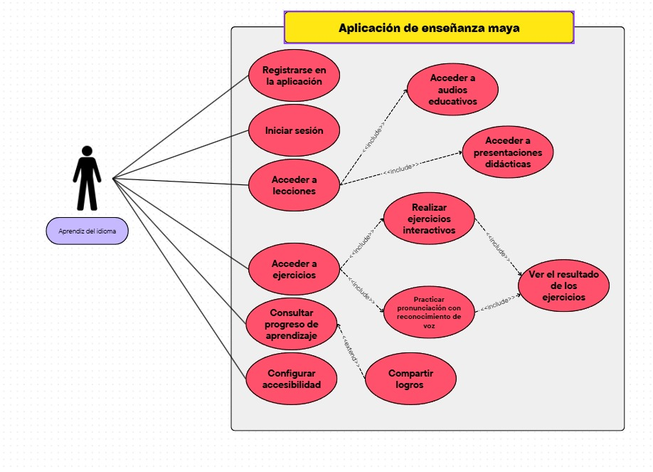

# 🐆 Mayapprendo — App para el Aprendizaje de la Lengua Maya

## 📌 Descripción del Proyecto

Mayapprendo es una aplicación diseñada para facilitar el aprendizaje autónomo, divertido y accesible de la lengua maya yucateca. El proyecto emplea metodologías de gamificación, ejercicios interactivos y contenido cultural auténtico para crear una experiencia de aprendizaje integral que preserve y revitalice este patrimonio lingüístico de la Península de Yucatán.

### Estado del Proyecto

- **Fase:** Proof of Concept (PoC) – Prototipo
- **Entrega:** 2/3

### Mockup

Puedes acceder a un despliegue de nuestro mockup [aquí](https://marunui.github.io/testingsito/).

## ⚖️ Propósito y Justificación

La lengua maya es un patrimonio de la Península de Yucatán y una joya cultural que porta la historia y cultura del pueblo maya. Sin embargo, enfrenta un riesgo creciente de desaparición debido a la falta de recursos educativos modernos y atractivos para las nuevas generaciones.

El propósito de este proyecto es crear una aplicación para el aprendizaje autónomo, divertido y accesible de la lengua maya. Esto se logrará mediante lecciones gamificadas, ejercicios prácticos y el cuidado de una mascota virtual que motive a los alumnos. La aplicación busca ser un instrumento cultural que promueva la diversidad lingüística y el acceso inclusivo al conocimiento cultural.

El valor principal de la aplicación es:
- Revitalizar el idioma maya yucateco.
- Promover la inclusión y el respeto cultural.
- Fortalecer la identidad regional, conectando a los usuarios con su herencia ancestral.
- Ofrecer una experiencia integral, accesible y actualizada que actualmente no existe en otras iniciativas digitales.

## 🏗️ Estructura del Repositorio

```
Proyecto Final/                  # Desarrollo principal del proyecto final de la materia
├── docs/                        # Documentación técnica y de proceso
│   ├── design/                      # Sistema de diseño completo (guías de estilo, assets en alta calidad, wireframes)
│   ├── proceso/                 # Metodología ágil y gestión del proyecto
│   │   └── bitacoras/           # Registro de reuniones, decisiones y distribución de trabajo
│   ├── producto/                # Especificaciones técnicas y documentación del producto
│   └── requisitos/              # Análisis y definición de requisitos funcionales y no funcionales
│       └── artefactos/          # Entregables de análisis (user stories, casos de uso, diagramas)
├── mockup/                     # Prototipos interactivos y navegables
│   └── assets/                  # Recursos visuales específicos para los mockups (icons, imágenes optimizadas)
└── README.md                    # Documentación interna del proyecto - detalles técnicos y configuración
```

## 🎯 Alcance del Proyecto

### Aspectos Incluidos

- **Pantallas de autenticación simuladas:** interfaces de login, registro y recuperación de contraseña (sin funcionalidad real)
- **Interfaz con identidad cultural:** diseño amigable con ilustraciones y elementos visuales inspirados en la cultura maya
- **Sistemas de gamificación simulados:** XP, logros, rachas, misiones diarias y mascota virtual "Balam" (con datos de ejemplo)
- **Contenido educativo demostrativo:** lecciones de ejemplo con vocabulario ilustrado y audio
- **Ejercicios interactivos básicos:** actividades de opción múltiple y respuesta abierta (sin persistencia de datos)
- **Seguimiento de progreso local:** estadísticas de avance que se reinician al recargar la página
- **Elementos de motivación visual:** tienda de recompensas y personalización de mascota (sin transacciones reales)
- **Contenido cultural:** sección "¿Sabías que?" con datos curiosos predefinidos
- **Diseño responsivo:** adaptación a diferentes tamaños de pantalla
- **Opciones de accesibilidad:** modo oscuro, ajustes de texto y volumen

### Limitaciones Definidas

- **Sin backend:** no incluye autenticación real, base de datos ni persistencia de datos
- **Sin funcionalidades sociales:** no incluye conversación en tiempo real entre usuarios
- **Sin componentes en línea:** no ofrece clases grupales, competencias o funciones colaborativas
- **Sin validación formal:** no proporciona certificación oficial ni validación académica
- **Contenido limitado:** no incluye lecciones avanzadas como práctica de glifos o pronunciación
- **Sin gestión de usuarios:** no permite registro real, recuperación de cuenta ni exportación de progreso
- **Sin conectividad:** no funciona offline ni sincroniza datos entre dispositivos
- **Accesibilidad incompleta:** incluye ajustes visuales pero no está optimizada para discapacidades visuales/auditivas severas



## 👥 Equipo de Trabajo

- **Product Owner:** [Octavio Pérez](https://github.com/octavpg) - Gestión del backlog, priorización de requisitos, validación con cliente
- **Scrum Master:** [Danna Sansores](https://github.com/dannasansores) - Facilitación del proceso Scrum, eliminación de obstáculos, bitácoras
- **Documentador:** [Leonardo Isaías](https://github.com/manriqueespinosaleonardo) - Casos de uso, especificaciones, manuales, documentación técnica
- **UI/UX Designer:** [Maru Perdomo](https://github.com/marunui) - Prototipos, guías de diseño, assets visuales, validación de interfaces
- **Técnico del Repositorio:** [Eli Scott](https://github.com/melismau) - Organización, documentación del repositorio, reviews, soporte técnico
- **Codificador:** [Eithel Soberanis](https://github.com/eithelsoberanis-coder) - Implementación del mockup HTML/CSS/JS, interactividad

---  

<div align="center">

**Universidad Autónoma de Yucatán**  
Facultad de Matemáticas - Ingeniería de Software  
Fundamentos de Ingeniería de Software  
Período: Agosto-Diciembre 2025  

</div>
