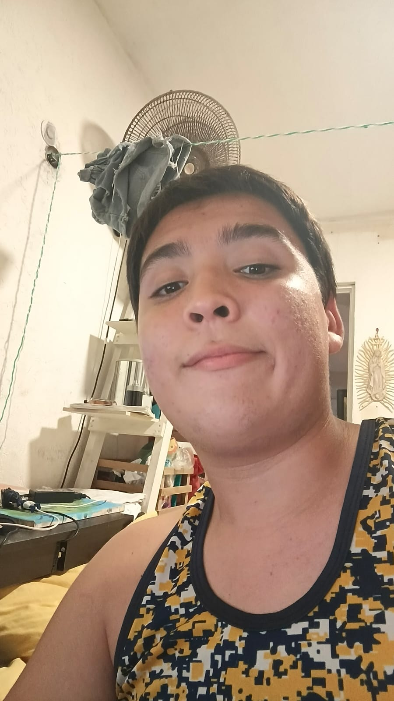

# FIS-Cambranes-EQ1
Repositorio para administrar la entrega de las tareas, actividades, y demás proyectos para la materia de Fundamentos de Ingeniería de Software en la UADY.

---

| Integrantes del equipo | Función | Imagen |
|------------------------|---------|--------|
|[Danna Sansores](https://github.com/dannasansores) | Líder del equipo |  |
|[Leo Isaias](https://github.com/lime07) | Backend |  |
|[Maru Perdomo](https://github.com/marunui) | | |
|[Octavio Perez](https://github.com/octavpg) | | |
|[Eli Scott](https://github.com/melismau) | Organización y documentación del repositorio |  |
|[Eithel Soberanis](https://github.com/eithelsoberanis-coder) | | |
